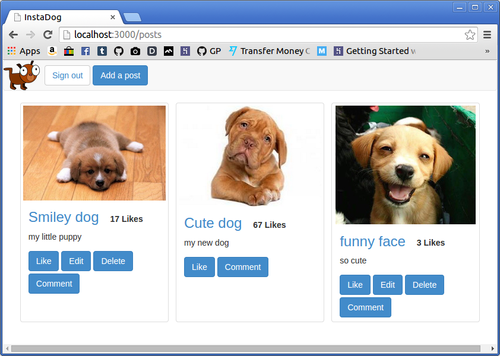

[](https://codeclimate.com/github/elenagarrone/instaDog)
[](https://codeclimate.com/github/elenagarrone/instaDog)

instaDog
========
As weekend challange for week 8 we had to build an Instagram clone using Rails.



Specification:
-------------
- Visitors can create a post using a form, specifying a name, chosing an image and writing a description
- Posts can be edited and deleted
- Visitors can leave comments and 'Like' a post
- The posts listings page should display all the images and description, along with the number of likes for each post
- Users can register/login
- A user must be logged in to create a post
- Users can only edit/delete posts which they've created
- Users can delete their own comments
- Some indication is given on the page (as part of the layout) whether the user is currently logged in, along with links to the available actions (i.e. Logout/Edit account is signed in, otherwise Sign In/Sign Up)

Technologies:
-------------
- Rails
- Ruby
- Capybara
- RSpec
- Device
- PostgreSQL
- Poltergiest
- Omniauth
- Facebook API
- AJAX in Rails

To do:
======
- [ ] amazon web services to store the images
- [ ] deploy to Heroku

How to test:
------------
Clone the repo:
```shell
$ git clone https://github.com/elenagarrone/instaDog.git
```
Change into the directory:
```shell
$ cd instaDog
```
Install the gems:
```shell
$ bundle install
```
Run:
```shell
$ rspec
```
